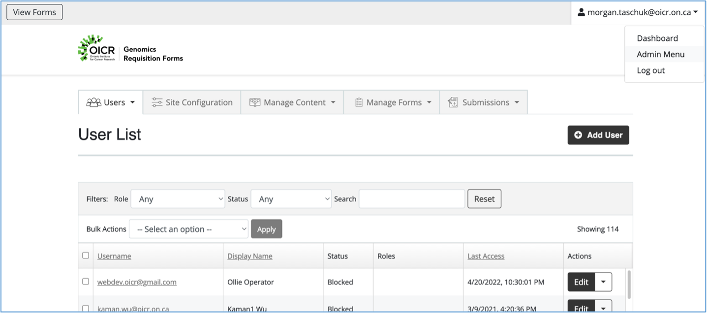
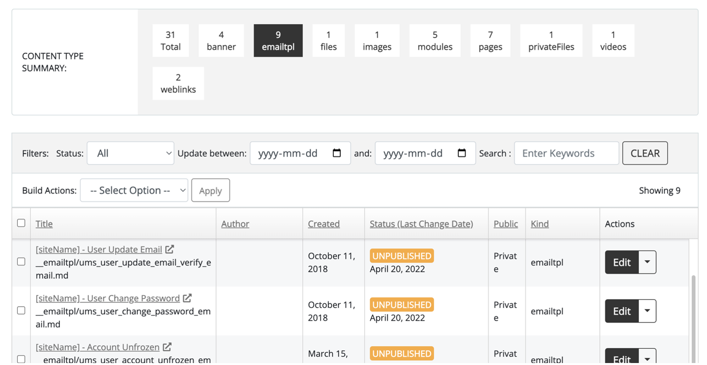

.. _form-admins:

###################
Form Administrators
###################

The Form Administrator is a global role that can perform the same tasks as :doc:`study-admins`, but can see all requisition study forms. The Form Administrator can additionally clone new forms, archive and delete forms, and back up and restore forms from Github.

Creating (cloning) a new requisition form
------------------------------------------

#. Navigate to the “Manage Forms” tab and select the form to be cloned. 
#. Click on the gear box in the right-hand margin and select “Clone Form”.
#. Select the clone draft form.  Note the cloned form will be titled “OICR Genomics Requisition Form Template” with the exact time the form was cloned.

Permanently Delete a Draft Study Specific Requisition Form
------------------------------------------------------------

1.	Navigate to “Manage Forms>Study Specific Requisition”.  
2.	From the gear icon in the upper right margin, select “Delete Form”. 
3.	To permanently delete a form, select the checkbox. 
4.	A second confirmatory dialog box will appear.  The form administrator password is required to delete the form.  Select Yes, Delete.  This form may only be recovered from system archives stored off site

Archive a Study Specific Requisition Form
------------------------------------------------------------

1.	Navigate to “Manage Forms>Study Specific Requisition”.  
2.	From the gear icon in the upper right margin, select “Delete Form” and select “No, don’t delete, archive only”. 
3.	To view archived forms, navigate to “Manage Forms” from the Dashboard, and select “show archived”. 
4.	The archived form may be cloned, imported, exported or undeleted from the requisition gear icon.  When an archived form is “undeleted”, the form will reappear on the forms dashboard.
5.	The Excel-based  report may be configured for specific information.

Committing (Exporting) Individual Form Metadata to Github
------------------------------------------------------------

All changes to a specific form’s metadata may be committed to the private OICR Github repository (webdev_gsi-forms). Exporting a form will “copy” a form’s existing meta data which includes form structure, question definitions, workflows, and emails. Submissions will not be impacted, nor are they exported to GitHub.   Staff assigned to the form will not be impacted, nor will assigned staff be exported to GitHub.  Should the need arise in future, the import function of the requisition system may recall the form metadata to an active form from Github.  

1.	From a requisition form menu, navigate to the gear icon and select “Export Form” as seen below. 
	
	.. image:: images/export-form-meta.png

2.	A dialogue box will appear to confirm the export of the form template to Github.
3.	Review the export in Github (https://github.com/gsi-forms/webdev_gsi-forms) by navigating to the “<> code” icon and selecting “Compare”. 
4.	Scroll downward to the appropriate commit which will appear as “export from meta”.
5.	Click on “export form meta” as seen above, record the commit ID.  This ID will help confirm the correct form is imported if the need arises in future. 
6.	At the bottom of the page, include a comment regarding the form committed and changes made to the form. 
7.	Comments may be reviewed from the “compare” Github page.

Importing Individual Form Metadata from Github to the Requisition System
-------------------------------------------------------------------------

Forms committed (exported) to Github may be imported to the OICR Genomics Requisition System. Note, importing a form will replace an individual form’s existing meta data which includes form structure, question definitions, workflows, and emails. Existing submissions will not be impacted.   Staff assigned to the form will not be impacted.  

1.	Navigate to the Requisition System. From the gear icon, select “IMPORT”.
2.	A dialogue box will appear, select “Import”. The form’s metadata will be imported and replace existing form metadata. 
3.	A dialog box will appear in the upper right corner confirming “The form has been successfully imported”.

Saving a Copy of the Requisition System Software to a Local Drive
------------------------------------------------------------------

Major software revisions must be registered using QW-029 Software Update Form before updating the software version tag in Github.  The OICR Genomics Requisition System software version token will be updated on all webpages and emails when the Github software tag is updated; this process occurs through a cron job and is executed in approximately 10 minutes.  This includes all forms, emails, and webpages.  https://github.com/gsi-forms/webdev_gsi-forms/releases/tag/req.v1.3 

1.	To download a copy of the OICR Genomics Requisition System software, navigate to https://github.com/gsi-forms/webdev_gsi-forms/tags
2.	Download the appropriate software version. 

Merging Published Requisition Forms (New Software Release)
-----------------------------------------------------------

Legacy requisition forms may be merged into a new unified study form if required by the Forms Administrator.  This scenario may occur if form fields change, such as with the addition of a new assay to a clinical study, or if software versions result in large scale changes to requisition system workflows.  All existing requisitions will be ported into the new study form and will be permanently removed from the legacy study form. To execute a merger, proceed with the following steps.

1.	Prior to moving existing (legacy) study specific requisitions to a new form, navigate to the gear icon and select “MISO download”.  
2.	Save a copy of the excel report. Note the requisition “Submission ID” field will be the same between the original study form present in version 1 of the (legacy) form, and in version 2 of the new form after importing the requisition. The requisition ID “ID” however, will be updated.  The number will remain the same, but the form key will change to the new requisition form “form key”, in the example below the new form key is “V3PIL-XX”.  If the forms key is not changed between version 1 (legacy) and version 2 of the form, the requisition ID will remain exactly the same.
3.	Unpublish the legacy form to prevent new submissions from occurring from the legacy form.
4.	Select “Move Submissions” from either the gear icon on the “Manage Forms” tab, or directly from the form specific configuration pages. 
5.	A warning dialog will appear. Follow instructions listed and select “Yes, Move”. 
6.	Note, the case history for each imported requisition will contain all prior status stage changes executed from the legacy form. Any existing versioned draft genomic, QC or signed out clinical report will be viewable to authorized study roles.  PDF files will retain the legacy study requisition ID and will not be updated.  
7.	From the new form, repeat steps 1& 2.  Use the “Submission ID” to map old requisitions to the new requisition “ID”.  Provide this mapping key to the study requisitioners if the forms key has changed.  They may need to update their records to ensure continuity.
8.	Update MISO LIMS records to record the updated requisition ID, only if forms keys have changed.
9.	Inform the requisitioner, that the legacy form will no longer be visible, nor will the legacy form be populated with requisitions. 

.. _global-admins:

########################
Global Administrators
########################

The global Administrator is a role that permits full access to the Requisition system, except for PHI and submissions.

Navigating the Admin Menu
-------------------------

1.	Click the logged-in user’s name at the top left and select “Admin Menu”.
2.	A new view on the Dashboard will be visible with 5 tabs: Users, Site Configuration, Manage Content, Manage Forms, and Submissions. Manage Forms and Submissions operate the same way as for other users.

	#. Users: listing all users of the Requisition System. The table shows the user’s email and display name, status of the account, any global user roles, the last access time of the user, and an Actions dropdown.
	#. Site Configuration: Top level configuration for the Requisition System as a whole, including setting who can register accounts, what happens when a user’s account is cancelled, etc.
	#. Manage Content: view and change the base pages and emails for the whole site.
	#. Manage Forms: same as for other users 
	#. Submissions: same as for other users. Note that the global Administrator cannot see submissions or PHI.

Promoting a user to Form Administrator or global Administrator
---------------------------------------------------------------------------

All Form Administrators and global Administrators need access both to the administrative functions as well as access to the Github repositories that back the Requisition system.
First, grant the role within the Requisition System.

1.	Go to the Admin Menu and select the Users tab.
2.	Locate the user in the table and click ‘Edit’ in the Actions dropdown.
3.	In the User Settings section, select “administrator” for global administrator or “form administrator” to give the user the appropriate role.
4.	Click “Save Changes”.

Next, grant permissions on Github to webdev_gsi-forms and nodejs-apps.

1.	Contact the user to get their Github username
2.	Go to https://github.com/gsi-forms/webdev_gsi-forms
3.	Click on the Settings tab
4.	Under Access, click on Collaborators and teams
5.	Under Manage access, clikc the ‘Add people’ button.
6.	Enter the Github username for the new admin. Select ‘Admin’ for the role, and click ‘Add to this repository’.
7.	The new admin should get an email inviting them to the repository, or they can navigate to the repository to accept the invitation.
8.	Repeat steps 1-7 for https://github.com/gsi-forms/nodejs-apps.

Modify a system email
-----------------------

“System email” refers to an email such as the new user email or the forgotten password email, that is not an email notification from a particular study. 

1.	Go to the Admin Menu and select the Manage Contents > ALL CONTENTS tab
2.	In the content type summary section, select “emailtpl” to filter by emails.
3.	Locate the email in question in the table. See the screenshot below. Click on the Title to open the email in the Github repository https://github.com/gsi-forms/webdev_gsi-forms .

	a.	Note that the Edit button in the Action drop down does not work correctly and will not save. You can use this to edit the HTML in a WYSIWYG editor, however, and then copy the HTML to Github.

4.	Edit the html for the email as desired.
5.	Add a commit message to the box at the bottom explaining what was changed. Select ‘Commit directly to master branch’ and ‘Commit changes’.
6.	Within about 15 minutes, the table on ‘Manage Contents’ page should show a new last modified time and the email will be ready to send.

.. toctree::
   :maxdepth: 2

+----------------+----------------------+
| **Change Log** | `Github commit log`_ |
+----------------+----------------------+

.. _Github commit log : https://github.com/oicr-gsi/req-system-docs/commits/main/source/global-users.rst
