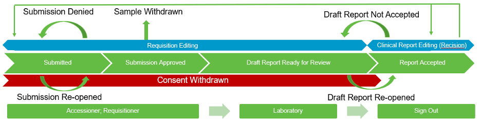
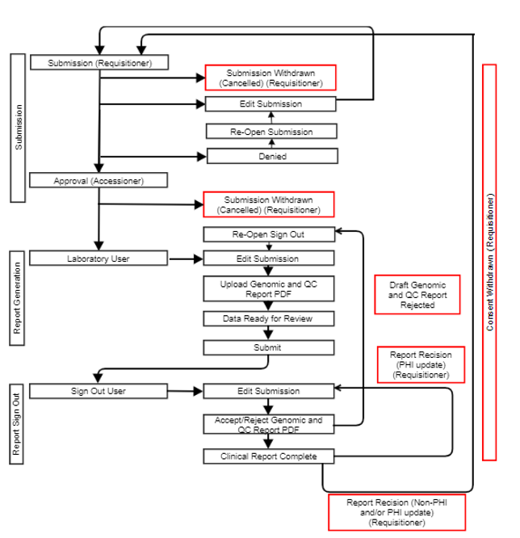

###############
Introduction
###############

The OICR Genomics Requisition and Reporting System (the Requisition System) is a user role-based secure portal for the submission of test requisitions and associated tissues for OICR Genomics’ validated genomics assays. OICR Genomics complies with the ISO 15189 standard. 

Scope
======

ISO 15189 requires patient PHI to be collected and included on clinical reports, however, OICR does not permit receipt of PHI. A system was designed to a) create requisition forms, b) de-identify samples prior to receipt at OICR, and c) re-associate PHI with clinical results on the final report, which is only visible to the reviewing licensed Geneticist and Clinical Coordinator. This ensures that samples can be appropriately tracked throughout laboratory processing without exposing PHI to OICR staff.  OICR engaged independent third parties to conduct a Privacy Impact and a Threats and Vulnerabilities Assessment, addressing audit recommendations before implementing this system. 

The purpose of this Standard Operating Procedure (SOP) is to describe the Requisition and Reporting software and to define procedures for its use and maintenance, including account access, study requisition form configuration, email notification management, case history management, user roles and functions, system administration and updates.

System Description
==================

The OICR Genomics Requisition System retains all required PHI in an access-restricted database accessible to Clinical Coordinators and licensed Geneticists. PHI must never be transmitted, shipped or communicated in print or via digital platforms such as Slack or email; PHI may only be recorded via study specific requisition forms through the OICR Genomics Requisition System.

.. _requisition-lifecycle:

Requisition Lifecycle
=====================

Requisitions require actions from study-specific user roles to ensure that submission, draft genomic report generation and clinical report sign out occur in a stage-gated process.  The general processing stages of a requisition workflow are depicted below.  

In the ideal case, a requisition proceeds as follows:

1.	A Requisitioner submits a requisition form with PHI
2.	An Accessioner reviews the requisition form (no PHI) and approves the submission
3.	A Laboratory user uses the information from the approved requisition form to draft and submit a clinical report (no PHI)
4.	The Sign-Out user reviews the clinical report, adds PHI to the report, and submits a signed-out clinical report with PHI
5.	The Requisitioner retrieves the signed-out clinical report with PHI from the system.

.. _requisition-statuses:

Requisition Statuses
====================

A requisition may enter several other states depending on the specific case’s needs. For example, an assay may need to be changed in a requisition from a lower coverage to higher coverage. Email notifications alert user roles of tasks that require their attention or to confirm completion of an action/process. Requisition status is always visible within your user dashboard, see :doc:`navigation`. 

Below is a full list of every state that a requisition can be in. The permissible transitions from state to state are outlined below.

* Submitted:  A requisition has been submitted by a Requisitioner but has not yet been approved by an OICR Accessioner. Rescinded reports with Requisitioner changes to non-PHI fields may revert to this status state.
* Submission Approved:  A requisition has been approved by an OICR Accessioner.  Samples may be shipped.
* Submission Denied:  An OICR Accessioner has reviewed the submitted requisition and determined an error is present.
* Submission Reopened: A Requisitioner has reopened a previously denied requisition.
* Sample Withdrawn: A Requisitioner has withdrawn a submitted requisition, due to mistaken submission.
* Consent Withdrawn: A Requisitioner has indicated that a patient has withdrawn consent.
* Draft Report Ready for Review: A Laboratory user has uploaded a draft genomic report for review by a Geneticist (Sign Out user).
* Report Accepted, Sign Out Complete:  A Geneticist (Sign Out user) has reviewed the draft genomic report and accepted the case analysis. Sign Out is complete and a clinical report may be downloaded by a Requisitioner.
* Draft Report Not Accepted:  A Geneticist has not accepted the draft genomic report, revision is required.  Laboratory user must update/correct draft  genomic and/or QC report and upload copies.
* Sign Out Rescinded with PHI: A requisitioner has rescinded a signed out clinical report due to discovery of an error in PHI by a requisitioner or treating physician.     

.. _information-collected:

Information Collected for All Study Requisitions
================================================

The nature of OICR requisitions require the collection of PHI as well as other non-identifying information about specific cases. All data is maintained behind OICR’s firewall on storage encrypted at rest and given the highest level of protection. All internet communications between a user and the OICR Genomics Requisition System are encrypted with Open SSL and visibility is restricted based on user role.
The following is a list of information that is collected for every requisition. A specific study may have more requirements; check the Requisition System for the full list. Incomplete requisitions cannot be saved; all fields must be complete. Review this section thoroughly and ensure you have collected all required information.
Note: the standard format for dates is [YYYY]-[MM]-[DD] and the standard format for phone numbers is [area code]-[nnn]-[nnnn] x[extension], e.g. 416-111-1111 x111. Requisitioners are asked to use these formats for consistency.

Required PHI: 

* Patient name (first, middle and last), 
* Patient Date of birth
* Specimen collection date
* Referring lab identifier
* Referring physician, including first, middle and last name
* Physician email address
* Physician Medical license #
* Physician City
* Physician Phone #
* Physician Hospital 

Required Non-PHI 

* Study
* Patient study ID
* Patient sample study ID
* Genetic sex
* Consent status (yes/no)
* Primary cancer diagnosis
* Tumour type
* Oncotree code (see below)

OncoTree Codes
---------------

Tumors must be classified using `OncoTree codes`_.  Always select the “oncotree_latest_stable” version. OncoTree categorizes tumors by tissue and tumor type.  The web interface may be utilized to classify the tumor.  Use the respective tumor acronym, i.e.  for Fibrolamellar Carcinoma (FLC), enter the code “FLC” on the requisition Oncotree code text field.

.. _OncoTree codes: http://oncotree.mskcc.org/#/home

.. toctree::
   :maxdepth: 2
