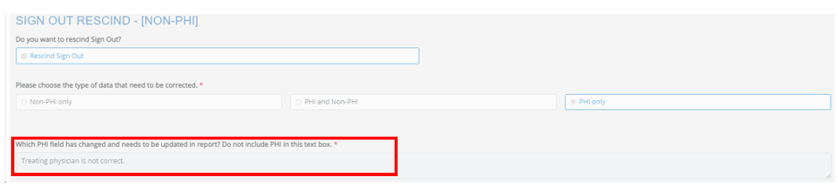
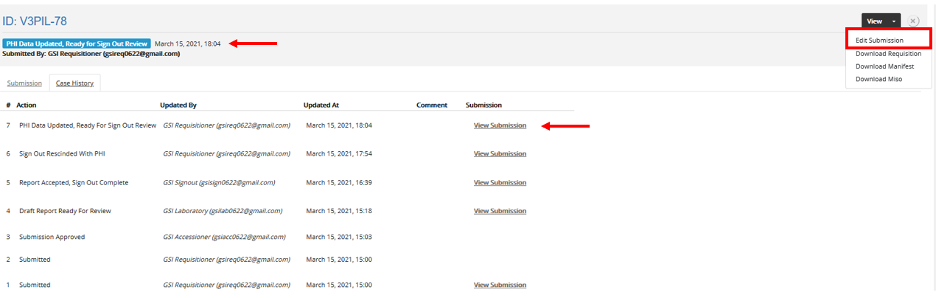

##################
Sign Out Users
##################

Licensed Geneticists (CCMG/ACMG) must review and approve draft genomic reports prior to inclusion of PHI and release of the clinical report to requisitioners for inclusion in patient medical records.

.. _review-draft:

Reviewing and Accepting/Rejecting a Draft Clinical Report
==========================================================

A notification email will be received.

#. From your account dashboard, navigate to the submissions tab and select the study specific requisition dashboard. 
#. All study requisitions requiring review will have status “Draft Report Ready for Review” Select “Edit Submission” for the respective requisition from the “Actions” column.
#. Within the requisition, scroll down to the section header “Data Report”.  Click on the “Genomic report (PDF)” and “QC Report (PDF)” to download and review both reports. 
#. Select either “Accept” or “Reject” the draft clinical report.  
#. If rejected, a note must be entered within the text field that will appear below the reject radio button.  Do not include any PHI in your explanation for rejecting the report.  The requisition status will display “Draft report not accepted”, and the requisition is locked pending review.  Consult with the CGI team to discuss the case and seek resolution.  CGI will reopen the requisition and provide a response, which will be visible in the case history.  If a resolution is found, repeat steps 1-4.
#. If accepted, update the draft report to include PHI. Upload the PHI containing clinical report PDF and select “Submit”. The clinical report is now viewable to the Requisitioner.  The requisition status will display “Report Accepted, Sign Out Complete”.  

Reviewing PHI Change Requests to Rescinded Reports 
==================================================

If a treating physician or a clinical coordinator observes an error in patient information (PHI, non-PHI, or both) on a signed out clinical report, the information may be corrected, and an updated clinical report will need to be issued.  

.. _sign-phi-change:

PHI Change Requests
-------------------

If a change is made to a requisition that impacts PHI only, the status of a submission will change to “PHI Data Updated, Ready for Sign Out Review”.

From within the requisition, scroll to the Sign Out Rescind- [Non-PHI] section header at the bottom of the requisition and review the Requisitioner’s comment field.

#. Navigate to the case history and review corrected requisition PHI information (in the example above, treating physician field). 
#. From the case history (shown) or from the main dashboard, select “Edit Submission”.

To accept the changes:

#. Scroll to the section “Approve Draft Report” and select “Accept” (the draft report does not contain PHI and is not impacted by a change in PHI).  
#. Next, remove the existing clinical report (containing PHI), and replace it with the clinical report with the corrected PHI. Scroll to the bottom of the requisition and select “Submit.” 
#. The state of the requisition will change to “Report Accepted, Sign Out Complete.”  The administrator, laboratory, and requisitioner will receive an email that the case is complete.

To reject the changes:

#. Scroll to the section “Approve Draft Report” and select “Reject” (the draft report does not contain PHI and is not impacted by a change in PHI). In the comments box, include your justification for not updating the PHI on the clinical requisition; a comment is required. Do not include PHI. Scroll to the bottom of the form and select submit.
#. The Requisitioner will receive an email.

.. _sign-consent:

Consent Withdrawal
==================

Withdrawal of patient consent is initiated by the study Clinical Coordinator (Requisitioner). 

#. A notification email will be received by all roles.  Consent withdrawal will appear within the requisition case history and may be quickly identified on study dashboards under “Consent withdrawn”. The requisition status will display “Withdraw Consent”.
#. If the clinical report has not been signed out, stop review.  If Sign Out is complete, no further action is required. 

.. toctree::
   :maxdepth: 2
